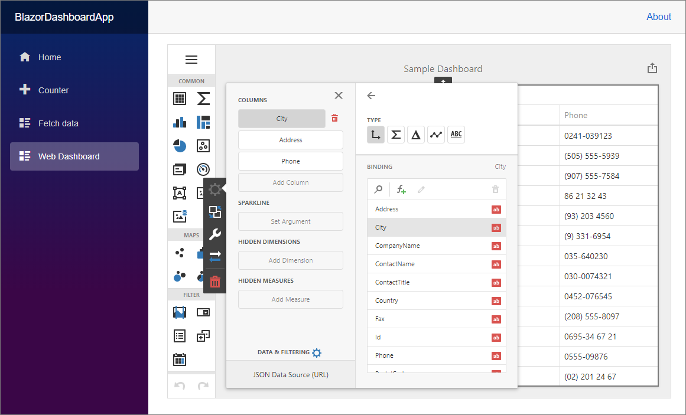

# How to use DevExpress HTML JavaScript Dashboard control in Blazor applications

This example demonstrates how to integrate the [HTML JavaScript Dashboard](https://docs.devexpress.com/Dashboard/119108/designer-and-viewer-applications/web-dashboard/html-javascript-dashboard-control) into a Blazor application.

The solution is based on the client-server model and includes the client and server parts.

**Note:** DevExpress Blazor components are now free-of-charge, but you need to purchase the [Universal Subscription](https://www.devexpress.com/buy/net/) to use the Dashboard product.

## Server Part

_Files to look at:_
* [Startup.cs](./CS/BlazorDashboardApp/Server/Startup.cs)

An ASP.NET Core application that processes requests from the HTML JavaScript Dashboard control. 

These are the main steps to configure the server side: 
1. Install the **DevExpress.AspNetCore.Dashboard** NuGet package.
2. Create the **App_Data/Dashboards** folder to store dashboards.
3. Register and adjust **DashboardConfigurator** in the **Startup** class.

## Client Part

_Files to look at:_
* [package.json](./CS/BlazorDashboardApp/Client/package.json)
* [Dashboard.razor](./CS/BlazorDashboardApp/Client/Pages/Dashboard.razor)
* [index.js](./CS/BlazorDashboardApp/Client/index.js)
* [index.html](./CS/BlazorDashboardApp/Client/wwwroot/index.html)
* [bundleconfig.json](./CS/BlazorDashboardApp/Client/bundleconfig.json)
* [NavMenu.razor](./CS/BlazorDashboardApp/Client/Shared/NavMenu.razor)

Defines the UI for the HTML JavaScript Dashboard control and implements the logic to respond to UI updates. 

These are the main steps to configure the client side: 
1. Install the **devexpress-dashboard**, **@devexpress/analytics-core**, **devextreme**, and **jquery-ui-dist** npm packages. 
2. Create the **Dashboard.razor** file for the HTML JavaScript Dashboard control. Invoke an initialization method in the **OnAfterRender** lifecycle event and release unused memory in the **Dispose** event.
3. Create the **index.js** file and implement the logic to initialize and dispose of the dashboard control. 
4. Install the **BuildBundlerMinifier** NuGet package and create the **bundleconfig.json** file to create bundles for required CSS and JavaScript files.
5. Register bundled resources in the **index.html** file.
6. Modify the **NavMenu.razor** file to add the Dashboard item in the menu.

## See Also

- [Dashboard for Blazor - How to use Web Dashboard within your Blazor Apps](https://community.devexpress.com/blogs/analytics/archive/2020/02/17/dashboard-for-blazor-how-to-use-web-dashboard-within-your-blazor-apps.aspx)
- [Create an ASP.NET Core Dashboard Application](https://docs.devexpress.com/Dashboard/119284/get-started/build-web-dashboard-applications/create-an-aspnet-core-dashboard-application)
